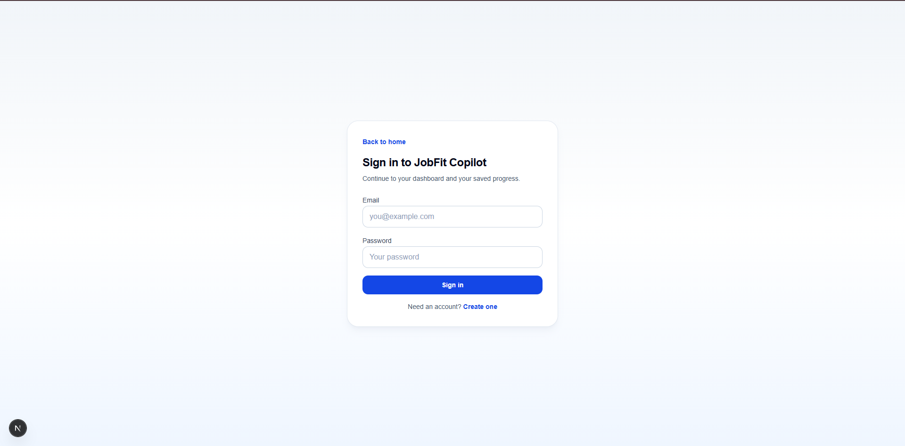
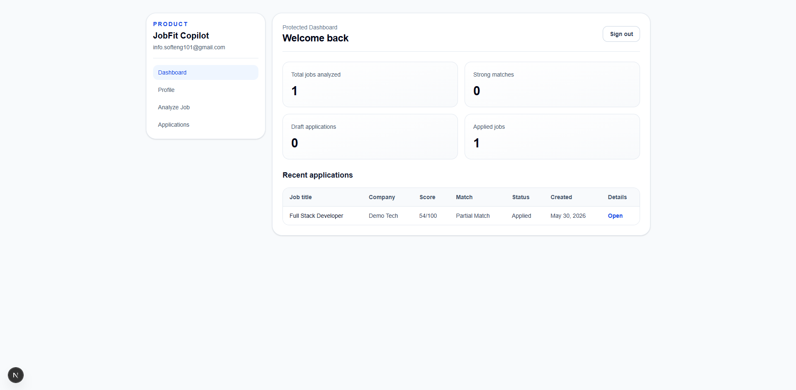
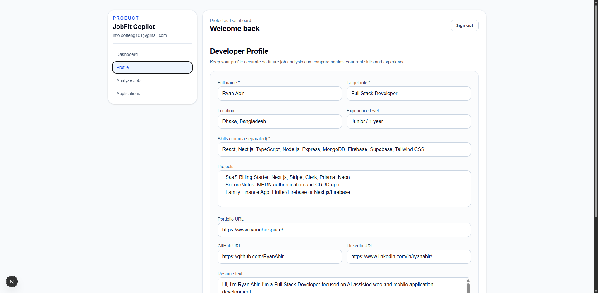
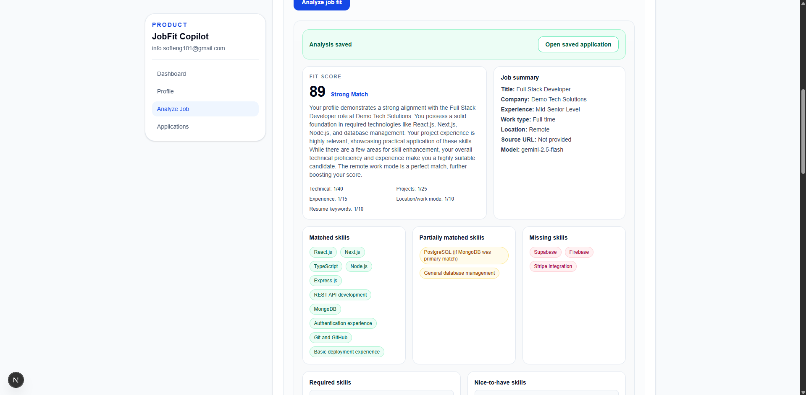
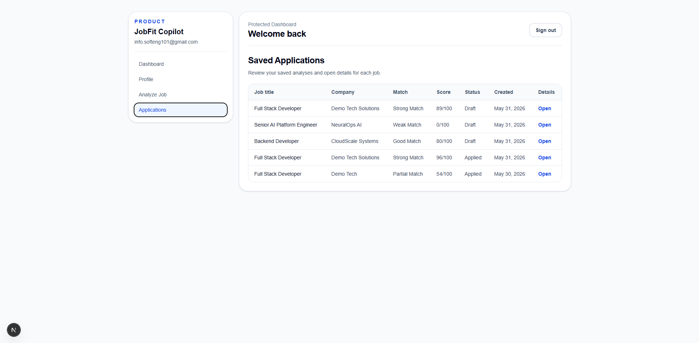
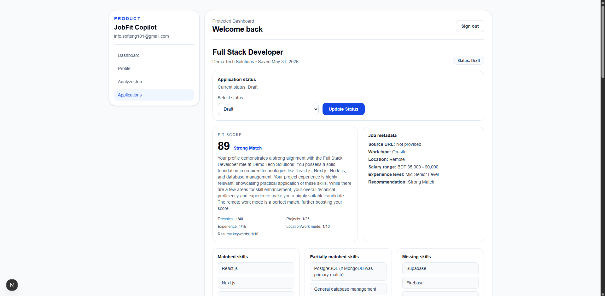

# JobFit Copilot

AI-powered job application assistant for developers.

## Live Demo
[View the live demo](https://jobfit-copilot-sigma.vercel.app)

## Problem Statement
Developers often spend too much time decoding long job posts, guessing fit, and writing generic applications. JobFit Copilot helps users make clearer, more honest application decisions by comparing real profile data against job requirements before applying.

## MVP Features
- Supabase authentication (sign up, sign in, sign out)
- Developer profile management
- Job post analyzer workflow
- Gemini-powered fit score
- Required and missing skills extraction
- Resume keyword suggestions
- Generated application email
- Saved applications
- Application status tracking
- Dashboard metrics (total analyzed, strong matches, draft, applied)

## Tech Stack
- Next.js 16 (App Router)
- React
- TypeScript
- Tailwind CSS
- Supabase Auth + PostgreSQL Database + Row Level Security (RLS)
- NVIDIA API (OpenAI-compatible chat completions via `fetch`) for primary text analysis
- Gemini API via `@google/genai` for fallback text analysis and screenshot extraction
- pnpm

## Architecture Overview
```text
User -> Next.js App Router UI -> Server Actions -> Supabase (Auth + Postgres + RLS)
                                         |
                                         -> NVIDIA API (primary text analysis)
                                         -> Gemini API (text fallback + image extraction)
```

Flow summary:
1. Authenticated user creates/updates developer profile.
2. User submits a job post from `/dashboard/analyze`.
3. Server action validates input and profile, then calls NVIDIA first and falls back to Gemini if needed.
4. Analysis is saved into `jobs`, `job_analysis`, and `generated_applications`.
5. User reviews results in saved application detail and tracks status.

## Database Tables
Core MVP tables:
- `profiles`
- `jobs`
- `job_analysis`
- `generated_applications`

Schema and policies are defined in:
- `supabase/migrations/001_mvp_schema.sql`

## Routes
Public routes:
- `/`
- `/sign-in`
- `/sign-up`

Protected routes:
- `/dashboard`
- `/dashboard/profile`
- `/dashboard/analyze`
- `/dashboard/applications`
- `/dashboard/applications/[jobId]`

## Local Setup
1. Clone the repository.
2. Install dependencies:
```bash
pnpm install
```
3. Create `.env.local` in project root.
4. Add required environment variables:
```env
NEXT_PUBLIC_SUPABASE_URL=
NEXT_PUBLIC_SUPABASE_ANON_KEY=
SUPABASE_SERVICE_ROLE_KEY=
GEMINI_API_KEY=
NVIDIA_API_KEY=
NVIDIA_BASE_URL=https://integrate.api.nvidia.com/v1
NVIDIA_MODEL=deepseek-ai/deepseek-v4-pro
NEXT_PUBLIC_APP_URL=
```
5. Run the MVP schema migration manually in Supabase SQL Editor using:
- `supabase/migrations/001_mvp_schema.sql`
6. Start development server:
```bash
pnpm dev
```

## Validation
```bash
pnpm lint
pnpm build
```

## Security Notes
- API keys are handled server-side.
- `SUPABASE_SERVICE_ROLE_KEY` is never exposed to the browser.
- Row Level Security (RLS) is enabled on private data tables.
- Data access is scoped to authenticated, user-owned records.
- The product does not provide auto-apply or spam automation.

## Ethical Boundary
- JobFit Copilot does not submit job applications automatically.
- It does not invent or fabricate candidate experience.
- Missing skills are surfaced explicitly and honestly.

## Current MVP Status
Completed:
- Authentication and protected dashboard routes
- Developer profile create/update
- AI job analysis with structured output validation
- Fit score, skills match/missing, red flags, and recommendation display
- Generated application email and resume keyword suggestions
- Saved applications list and detailed application view
- Application status updates with ownership checks
- Dashboard summary metrics and recent applications table

In progress / polish:
- Documentation and portfolio presentation assets (screenshots/demo)
- Additional UX polish and broader manual QA coverage

## Future Roadmap
- PDF resume generator
- Resume keyword optimizer improvements
- Browser extension / manual autofill helper
- Allowed job-board integrations only
- Analytics and application history insights

## Screenshots
### Landing page


### Dashboard


### Developer profile


### Analyze job with AI result


### Saved applications list


### Saved application detail


## Demo Script
1. Sign up or sign in.
2. Fill in developer profile details.
3. Paste a job post into Analyze Job.
4. Run AI analysis.
5. Review fit score, skills, red flags, keywords, and generated email.
6. Save and track application status from the dashboard.
